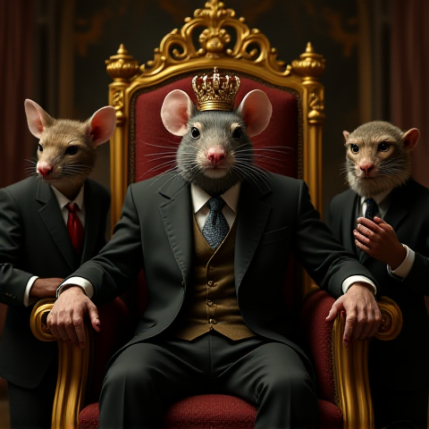

# Flux-Project---Image-Gen

A minimal image generation CLI tool powered by [Flux.1-dev](https://huggingface.co/black-forest-labs/FLUX.1-dev) from Hugging Face 🤖🎨. This project allows you to generate high-quality AI images from text prompts using a local pipeline built with 🤗 Diffusers and PyTorch.

## ✨ Features

- Generate images from a text prompt using Flux.1-dev
- Support for negative prompts
- Adjustable resolution, inference steps, and guidance scale
- MPS / CPU support for macOS (optimized for Apple Silicon)
- Saves output locally as PNG

## 📦 Installation

1. Clone the repository:
   ```bash
   git clone https://github.com/Madd-G/Flux-Project---Image-Gen.git
   cd Flux-Project---Image-Gen
   ```

2. (Optional) Create and activate a virtual environment:
   ```bash
   python3 -m venv venv
   source venv/bin/activate
   ```

3. Install the required packages:
   ```bash
   pip install -r requirements.txt
   ```

## 🚀 Usage

Run the CLI tool with your desired parameters:

```bash
python flux_generate.py \
  --prompt "A futuristic cityscape with neon lights and flying cars" \
  --negative_prompt "blurry, distorted, ugly" \
  --output my_output.png \
  --steps 30 \
  --guidance_scale 7.5 \
  --height 1024 \
  --width 1024
```

### Default Example

You can run the script without any arguments to use the default prompt:

```bash
python flux_generate.py
```

### Parameters

| Argument           | Description                                | Default                                                                 |
|--------------------|--------------------------------------------|-------------------------------------------------------------------------|
| `--prompt`         | Prompt text for image generation           | `"A cat in a glowing astronaut suit drifting inside a zero-gravity spaceship..."` |
| `--negative_prompt`| Words to avoid in the output image         | `"blurry, distorted, ugly, bad anatomy, disfigured, low quality"`      |
| `--output`         | Output file name                           | `flux_output.png`                                                      |
| `--steps`          | Number of inference steps                  | `30`                                                                   |
| `--guidance_scale` | Prompt adherence strength (higher = more literal) | `7.0`                                                           |
| `--height`         | Output image height in pixels              | `1024`                                                                 |
| `--width`          | Output image width in pixels               | `1024`                                                                 |

## 📁 Sample Outputs

<p align="center">
  
  
</p>

> Example results generated with this tool.

## 🧠 Model Used

- [Flux.1-dev](https://huggingface.co/black-forest-labs/FLUX.1-dev) by Black Forest Labs
- Loaded via `diffusers.FluxPipeline`
